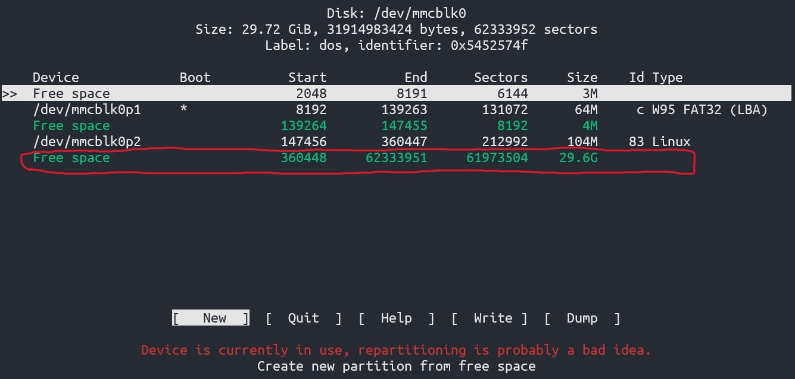
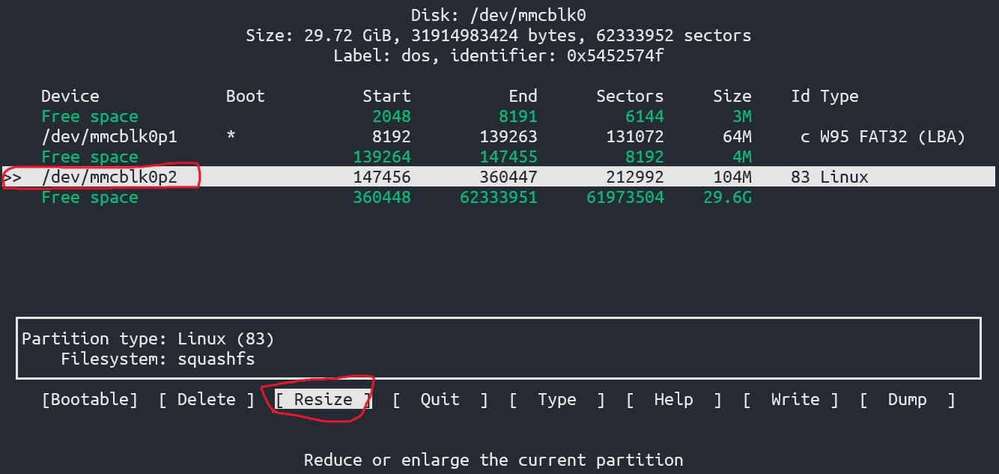
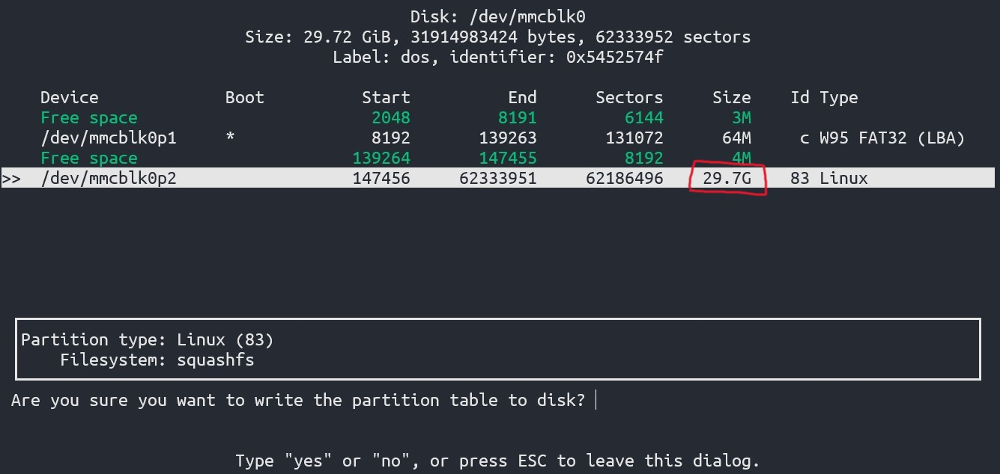
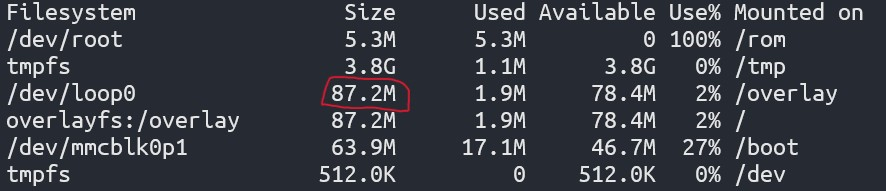
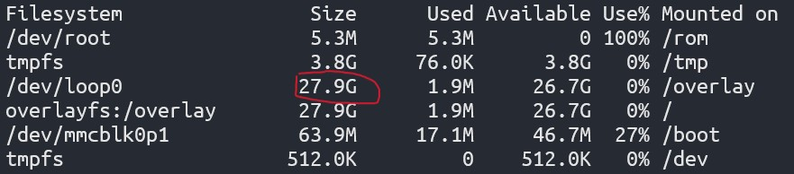

## 問題
我的 OpenWrt 是安裝在樹梅派上面，採用 squashfs, 安裝完後可以正常使用，但是可用空間只有 100 MB 左右，這是正常現象，如果沒有要安裝很多套件的話其實 100 MB 很夠用了，但是就無法完整利用到整個 SD 卡的空間 (我是裝 32G)；如果要裝 docker 等較大型的套件很快就空間不足了，故本篇文章即是要解決此問題。

> 其實官方有 [Wiki](https://openwrt.org/docs/guide-user/installation/installation_methods/sd_card) 教學是利用到 `losetup` 來完成，但是我自己嘗試是沒有成功的，我也懶得研究為甚麼，僅留下連結給有興趣的讀者自行嘗試看看。

## 解決方式

首先安裝套件，我們需要 `cfdisk` 和 `resize2fs`
```bash
opkg update
opkg install cfdisk resize2fs
```

安裝好後，可以先用 `ls /dev` 確認你的 SD 卡的 device 名稱，通常應該會是 `/dev/mmcblk0`

在 terminal 輸入以下指令
```bash
cfdisk /dev/mmcblk0
```

<br>接著你應該會進入 cfdisk 的互動式介面


可以看到在 `/dev/mmcblk0p2` 後面有很大的 free space.

接下來，用鍵盤移到 `/dev/mmcblk0p2`，會出現 `Resize` 的選項，選擇 `Resize`



這時系統會要你輸入要劃多大的空間，這裡不用輸入，保留預設值就好，這樣系統就會把所有的 free space 都劃進 `/dev/mmcblk0p2`，結果如下


完成後輸入 `yes` 確認變更，這時候從畫面上可以看到 `/dev/mmcblk0p2` 已經變成 29.7 G 了！確認沒問題後選擇 `Write` 把此次變更寫入，`Quit` 離開 cfdisk

接著重開機後，執行 `resize2fs`
```bash
resize2fs /dev/loop0
```

<br>若沒有錯誤訊息，就表示成功了，可以用 `df -h` 或是登入 luci 確認可用空間，以下提供 resize 前後的比較

#### Before


#### After


可以看到 `/dev/loop0` 的可用空間變大了！收工。

Reference
- [
Expanding OpenWrt squashfs image (SDcard)](https://forum.openwrt.org/t/expanding-openwrt-squashfs-image-sdcard/107711/12)
- [[OpenWrt Wiki] SD card](https://openwrt.org/docs/guide-user/installation/installation_methods/sd_card)
