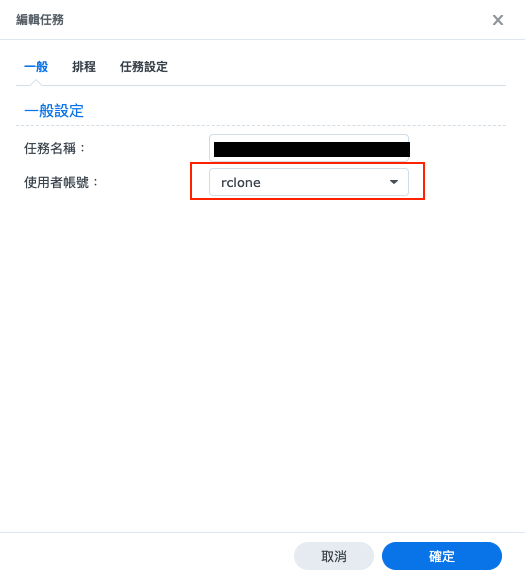

## 前言
本文說明如何在 Synology NAS 上使用 `rclone` 這套工具，搭配 pCloud 這個雲端來做到雲端方案的端對端加密備份，讓資料的保障更上一層樓

## 安裝 rclone
這邊以 macOS 為例, 透過 `brew` 安裝 rclone
```sh
brew install rclone
```

Synology NAS 的部分，本文會使用 docker 來執行 rclone, 因此無須在 Synolog 的 host 上面安裝 rclone

## 設定 rclone remote for pCloud

這個步驟是為了讓 rclone 取得存取 pCloud 的權限

ssh 進 Synology, 透過 docker 執行 rclone config
```sh
docker run --rm -it --volume /volume1/docker/rclone/config:/config/rclone --user $(id -u):$(id -g) rclone/rclone config
```

這邊請透過 volume 選項將 rclone 的 `rclone.conf` 設定檔放到你想放的 NAS 位置，如果沒加 volume 的話 `rclone.conf` 會放在 container 內，這樣就沒辦法保存設定給後面的備份設定使用，例如這邊的範例是我將 config 檔保存在 `/volume1/docker/rclone/config` 中，這樣一來在後面的 rclone 備份指令中就可以沿用這個步驟設定完成的 `rclone.conf`


進到 rclone 的互動式介面後，選擇 New remote，接著按照系統提示一步一步設定 pcloud remote (storage type 選擇 42 代表要加入 pcloud)

```
42 / Pcloud
   \ (pcloud)
```

範例設定如下 (client_id, client_secret 留空即可)
```
Storage> 42

Option client_id.
OAuth Client Id.
Leave blank normally.
Enter a value. Press Enter to leave empty.
client_id>

Option client_secret.
OAuth Client Secret.
Leave blank normally.
Enter a value. Press Enter to leave empty.
client_secret>

Edit advanced config?
y) Yes
n) No (default)
y/n> n

Use web browser to automatically authenticate rclone with remote?
 * Say Y if the machine running rclone has a web browser you can use
 * Say N if running rclone on a (remote) machine without web browser access
If not sure try Y. If Y failed, try N.

y) Yes (default)
n) No
y/n> N

Option config_token.
For this to work, you will need rclone available on a machine that has
a web browser available.
For more help and alternate methods see: https://rclone.org/remote_setup/
Execute the following on the machine with the web browser (same rclone
version recommended):
	rclone authorize "pcloud"
Then paste the result.
Enter a value.
config_token>
```

<br>

到了 Option config_token 這步，由於 Synology NAS 沒有 Web browser, 因此選擇 `n`，我們回到 macOS, 使用以下指令進行認證
```sh
rclone authorize pcloud
```

瀏覽器會跳轉到 pcloud 的登入頁面，登入成功後瀏覽器會顯示一個 access token，將這個 access token 貼回 Synology 的 rclone config 中就設定完成了

完成後 NAS 的檔案總管上在你指定的 volume 底下的 folder 預期可以得到一份 rclone.conf，請把這個檔案備份好


## 設定 rclone crypt remote pcloud

順利讓 rclone 取得 pcloud 的存取權限後，接下來我們要在 rclone 開一個 crypt remote, 把 pcloud 的指定路徑變成我們的端對端加密備份的路徑

在 Synology 上透過 docker 執行 rclone config
```sh
docker run --rm -it --volume /volume1/docker/rclone/config:/config/rclone --user $(id -u):$(id -g) rclone/rclone config
```

選擇 New remote，remote name 輸入 `pcloud_crypt`，Storage type 選擇 crypt
```
15 / Encrypt/Decrypt a remote
   \ (crypt)
```

接著會要你輸入想要 encrypt/decrypt 的 remote 以及 path
```
Storage> 15

Option remote.
Remote to encrypt/decrypt.
Normally should contain a ':' and a path, e.g. "myremote:path/to/dir",
"myremote:bucket" or maybe "myremote:" (not recommended).
Enter a value.
remote>
```

remote 就輸入你前面步驟設定的 pcloud remote (這裡的 remote name 以 `pcloud` 為例)，path 的部分，需要指定一個路徑，rclone 會在 pcloud 上面建立這個路徑的 folder, 並將這個 folder 作為 rclone 使用，因此若你平常就有在使用 pcloud 存放檔案的話，強烈建議一定要指定路徑，否則 rclone 會將整個 plcoud 的根目錄都拿來使用

這邊我指定了 `nas_backup` 這個路徑，這樣一來在之後透過這個 remote 操作備份時，rclone 就會在 pcloud 的根目錄建立 nas_backup 這個 folder 並將我們的檔案加密後放進這個 folder 中
```
Option remote.
Remote to encrypt/decrypt.
Normally should contain a ':' and a path, e.g. "myremote:path/to/dir",
"myremote:bucket" or maybe "myremote:" (not recommended).
Enter a value.
remote> pcloud:nas_backup
```

接著設定是否要加密檔案名稱 （預設加密）、是否要加密資料夾名稱（預設不加密），這邊依照個人偏好設定即可

接著最重要的一步：設定你的的加密金鑰 (password)
```
Option password.
Password or pass phrase for encryption.
Choose an alternative below.
y) Yes, type in my own password
g) Generate random password
```

可以選擇自己設定一個或是系統幫忙產一個 random password, 不論選哪一種，都請將這個加密金鑰備份好，否則將來無法解開你的備份檔案

後續還有一些進階保護的設定選項，例如是否要為你的 password 添加一個 salt、是否要加密 `rclone.conf` 等等，可根據個人需求參考官方文件去設定，本文不再贅述。

設定完成儲存後，在 rclone config 就可以看到我們成功新增了一個 crypt remote，至此 remote 的部分已經全數設定完畢，可以開始使用 rclone 備份資料了

## 使用 Docker Compose 執行備份

在這個步驟，我們要設定以下這個 docker-compose.yml 來當作我們的自動備份 task
```sh
version: "3.9"

services:
  rclone-foobar:
    image: rclone/rclone:latest
    container_name: rclone-foobar
    environment:
      - TZ=Asia/Taipei
    volumes:
      - /volume1/foobar:/data:ro                      # backup target
      - /volume1/docker/rclone/config:/config/rclone  # rclone.conf
      - /volume1/docker/rclone/logs:/logs             # log files
      - /volume1/docker/rclone/scripts:/scripts       # backup script
    # For Synology NAS, use the following entrypoint to run a custom script
    entrypoint: ["/bin/sh", "/scripts/backup-foobar.sh"]
```

有幾個設定的重點，皆透過 docker volume 進行
1. 備份目標資料夾 (e.g. `/volume1/foobar`)
2. `rclone.conf` 位置，把前面步驟設定 pcloud 產生的 rclone.conf 儲存在你要的地方並將 NAS 上的檔案路徑 (e.g.  `/volume1/docker/rclone/config`) 正確的 map 到 container 的 `/config/rclone` 這個路徑
3. log file 存放位置：為了日後備份失敗時可以 debug, 因此可以在 NAS 上開一個 log 資料夾給 rclone 使用
4. 備份 script 路徑 (e.g.  `/volume1/docker/rclone/scripts`) : 用來執行 `rclone sync` 指令，是備份主要的觸發點，將要執行的備份 script 透過 entrypoint 設定進 compose 中

範例的備份 script (`backup-foobar.sh`) 如下

```sh
#!/bin/sh
# This script is executed every time the container starts
# Can be used with DSM scheduler to start the container daily and trigger automatic backup

LOG_FILE="/logs/rclone.log"
echo "=== Rclone backup started at $(date) ===" >> "$LOG_FILE"

# Upload data to the encrypted remote
rclone sync /data pcloud_crypt:nas_backup \
  --transfers=2 \
  --checkers=4 \
  --exclude-from=/config/exclude_list.txt \
  --log-file="$LOG_FILE" \
  --log-level=INFO

echo "=== Rclone backup completed at $(date) ===" >> "$LOG_FILE"
```

- script 中的 `/data` 會透過 docker volume 指向你的備份目標資料夾，而 `pcloud_crypt:nas_backup` 就是剛剛我們在建立 crypt remote 時的 remote name 以及路徑
- `--transfers` 和 `--checkers` 可以根據個人的網路能力及需求設定，log 稍候可以透過 docker volume 的方式儲存在 NAS 上面以供日後 debug

接著我們設定檔案排除以及 logrotate 兩個功能

#### 設定排除檔案
Synology NAS 的資料夾會有一些 synology 專用的索引檔案可以不用備份，我們可以透過 `--exclude-from` 來設定這些 ignore file list，以下附上我從網路上找到用來 ignore Synology 檔案的清單：
```
@eaDir/**
#recycle/**
Thumbs.db
desktop.ini
.DS_Store
._*
.SynologyWorkingDirectory/**
```

#### 設定 logrotate
上面的 docker-compose.yml 範例，我們將 rclone 產生的 log 存在 `/volume1/docker/rclone/logs/` 中，為了必面日後 log 大小過大，因此我們利用 linux 的 logrotate 來處理 log 檔案的自動 rotate

在 NAS host 上新增一個 logrotate 設定
```sh
sudo vi /etc/logrotate.d/rclone
```

範例設定如下，細部設定可以依照個人需求調整
```
/volume1/docker/rclone/logs/*.log {
    daily
    rotate 7
    compress
    delaycompress
    missingok
    notifempty
    copytruncate
    size 50M
    maxage 14
}
```

測試是否能手動 rotate
```sh
sudo logrotate -f /etc/logrotate.d/rclone
```

### 測試
全部設定完成後，可以 ssh 進 NAS 確認 docker-compose 是否能順利執行：
```sh
docker-compose up
```

執行完畢後，container 會自動 exit，檢查 log 無異狀並且檔案有成功上傳到 pcloud 的話就表示成功了
可以順便在 pcloud 上面看你的檔案有沒有被成功的加密

## 透過 DSM 自動化排程備份
在前面的步驟中，我們已經寫好了一個可以手動進行端對端加密備份的 docker-compose.yml 了，下一步就是要將備份自動化，融入日常的 NAS 任務中，我們要利用 DSM 的 排程任務 (Task Scheduler) 來作這件事情

### 建立 rclone user
首先，為了防止 rclone 的權限過大，因此我們在 NAS 上為 rclone 建立一個獨立的 user, 來限制 rclone 能存取的資料夾以及讀寫權限，目標是只讓 rclone 可以讀我們的備份目標資料夾以及 docker 的執行權限，其他沒有要透過 rclone 備份的資料夾，該 user 無法存取

在 DSM 的控制台新增一個名為 `rclone` 的 user, 並將其加入 `docker` 這個 group，讓這個 user 可以不用透過 sudo 執行 docker (如何在 Synology 上建立 docker group 可以參考我之前寫的這篇[如何在 Synology NAS 使用 non-root user 執行 Docker command](/posts/run-docker-command-without-sudo-on-synology-nas))

資料夾權限、應用程式權限預設全部禁止存取，之後根據個人需求允許個別的資料夾權限就好

### 新增 DSM 排程任務
接著在 DSM 控制台的「任務排程表 (Task Scheduler)」建立一個任務

使用者設定 rclone



指令欄位輸入 docker-compose up 指令來執行我們上面步驟寫好的 yaml，範例如下：

```sh
docker-compose -f /path/to/your/docker-compose.yml up
```


設定好排程時間後就大功告成了，現在你的 NAS 已經實現了一個端對端加密的雲端異地備份服務
