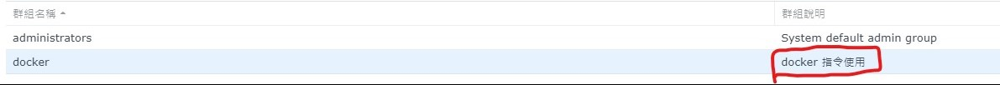

最近因為需要在 Synology NAS 上部署 [Coder](https://coder.com/)，container 需要 docker 的運行權限，因為 DSM 的 docker 比較特別，故這裡紀錄一下要如何讓非 root user 也能使用 docker

### 步驟

首先 ssh 進 NAS 後，使用以下指令來新增 "docker" 這個 group, 並把需要 docker 權限的 user 加入 docker group

```bash
sudo synogroup --add docker
sudo synogroup --member docker $USER # 將自己加入 docker group
```

<br>

成功新增後，登入 DSM，可以看到在使用者群組的地方多了一個 `docker`, 可以加上補充說明這個 group 的作用 (所以理論上應該直接在 DSM 新增 group 就好了，但是我沒試過)


接著將 docker.sock 的 group ownership 從 root 改成 docker
```bash
sudo chown root:docker /var/run/docker.sock
```

改完後重新登入，應該就可以不用加 sudo 就可以執行 docker command 了！

### Reference
- [Manage docker without needing sudo on your Synology NAS](https://davejansen.com/manage-docker-without-needing-sudo-on-your-synology-nas/)
