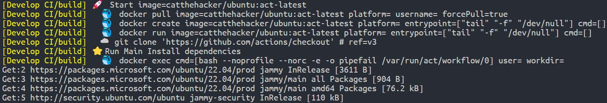

## 前言
最近在寫 side project 時想要設定 [Github Actions](https://docs.github.com/en/actions) 來自動化編譯跟測試流程，但是按照我之前的經驗是第一次設定 github action 的 workflow 時都會需要不斷修改來達到自己想要的結果，但是如果想要測試的話就會需要一直 commit & push 到 github 上面才有辦法測試，因此這次在設定 workflow 前，我想要找到一個可以不用 push 到 github 就可以在 local 端測試我的 workflow 的工具，這樣我就可以先測試完我的 workflow 後再一次 push 上去 github, 減少設定錯誤的機會，也不用一直繁瑣的 commit & push.

而我找到的工具就是 [nektos/act](https://github.com/nektos/act) 這個專案，目前在 github 上約有 40k 個 stars，可見這個需求有多大，本篇文就是紀錄如何使用這個工具的筆記。

## Install
`nektos/act` 這個專案有提供多種平台以及安裝方式，因為基本上我只會用這個工具來測試我的 workflow 有沒有寫錯，因此我選擇的是安裝官方提供的 [GitHub CLI](https://cli.github.com/) 擴充套件

### Install Github CLI
[Offical installation guide](https://github.com/cli/cli#installation)

首先按照官方教學安裝 Github CLI

```bash
type -p curl >/dev/null || (sudo apt update && sudo apt install curl -y)
curl -fsSL https://cli.github.com/packages/githubcli-archive-keyring.gpg | sudo dd of=/usr/share/keyrings/githubcli-archive-keyring.gpg \
&& sudo chmod go+r /usr/share/keyrings/githubcli-archive-keyring.gpg \
&& echo "deb [arch=$(dpkg --print-architecture) signed-by=/usr/share/keyrings/githubcli-archive-keyring.gpg] https://cli.github.com/packages stable main" | sudo tee /etc/apt/sources.list.d/github-cli.list > /dev/null \
&& sudo apt update \
&& sudo apt install gh -y
```

<br>

安裝完畢後，在終端機上打 `gh` 就可以使用 Github CLI 了
```bash
gh --help
```

### Install nektos/act
首先，必須確認你的電腦已經安裝 `docker`, 因為這個工具會使用 `docker` 來建構它的執行環境、跑 workflow
若你的環境是 WSL2, 則可以直接安裝 [Docker Desktop on Windows](https://docs.docker.com/desktop/install/windows-install/), 按照官方教學設定好後，在 WSL2 裡面應該就不用再特別設定就可以使用 `docker` 了

接著就可以按照 [nektos/act](https://github.com/nektos/act) 的 readme 教學安裝 `gh-act`

```bash
gh extension install https://github.com/nektos/gh-act
```

<br>

安裝完畢後，在終端機打 `gh act` 就可以使用 `act` 來測試我們自己撰寫的 workflow 了！

## Run
第一次使用 `act` 會需要設定一些東西，按照工具的引導後就可以測試 workflow 了

直接執行 `gh act`，它會自動抓你的專案底下的 workflow 並觸發 `on: push` 事件，然後開始執行你的 workflow
```bash
gh act
```

<br>

如果你的 workflow 中有需要用到 `GITHUB_TOKEN` 的話，`act` 也有參數可以直接帶入
```bash
gh act -s GITHUB_TOKEN="$(gh auth token)"
```

<br>

成功執行 workflow 的實際畫面如下，提供讀者參考


## Reference
- [nektos/act](https://github.com/nektos/act)
- [Github Actions](https://docs.github.com/en/actions)
- [GitHub CLI](https://cli.github.com/)
- [Docker Desktop on Windows](https://docs.docker.com/desktop/install/windows-install/)
