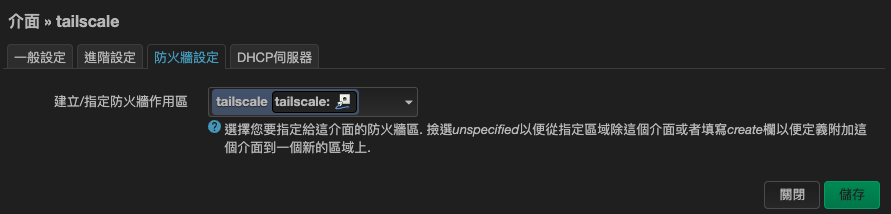
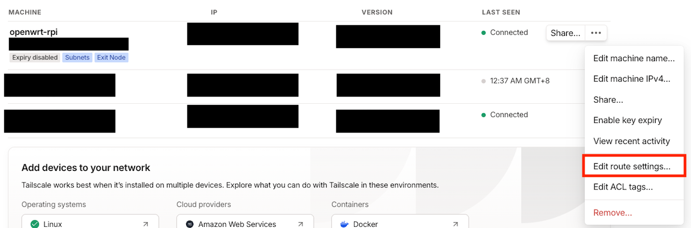
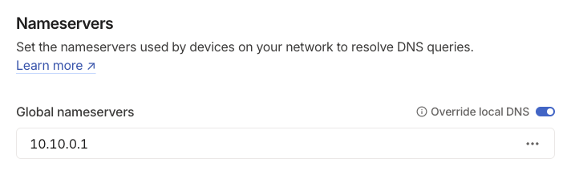

## Tailscale 簡介
Tailscale 是一款基於 WireGuard 技術的點對點虛擬私人網路 (VPN) 解決方案。與傳統的 VPN 不同，Tailscale 的設計目的是簡化網路配置和安全性管理，無需繁瑣的防火牆設置或是專業的網路知識。它透過 Tailscale 提供的控制伺服器自動處理網路節點之間的連線協商，無需使用者具備 Public IP。Tailscale 支援多種作業系統和設備，包括 Linux、Windows、macOS、iOS、Android 等，並且可以輕鬆應對現代網路環境中的 NAT 穿透問題。

有關 Tailscale 運作原理的介紹，可以參考[官方的說明](https://tailscale.com/blog/how-tailscale-works)

### 為何選擇 Tailscale
由於我目前的網路環境，我的 openwrt 拿到的 WAN IP 是第四台的 private IP，然後再透過他們的 NAT 出去，無法直接拿到一個 public IP 連接到 Internet，因此如果使用 DDNS + Wireguard 的解決方案的話還需要請第四台廠商幫我開 port forwarding。因為我不希望更改租屋處的網路設定，因此選擇了 Tailscale 作為解決方案。Tailscale 的好處在於它可以透過其伺服器自動協商並建立 VPN 網域，不需要準備一個 Public IP。


## 在 OpenWrt 上安裝 Tailscale
在 OpenWrt 的官方 wiki 上有一篇[教學文章](https://openwrt.org/docs/guide-user/services/vpn/tailscale/start)，是使用 opkg 上面已經打包好的 package 安裝 Tailscale, 但我抓下來發現 opkg 上提供的 tailscale 版本為 1.32，而我安裝的當下 tailscale 已經出到 1.74 版了，且官方有警告 1.32 版本存在安全性問題，因此我後來決定不透過 opkg 安裝 Tailscale

> 如果你也跟我一樣先前已經透過 opkg 安裝舊版本的 tailscale 了，則可以透過 `opkg remove tailscale` 先將舊版 tailscale 移除
> 移除後系統仍會殘留兩個 binary: `/usr/bin/tailscale` 以及 `/usr/sbin/tailscaled`，必須要將這兩個 binary 刪除或是稍候直接用從官網下載的 binary 覆蓋過去，這樣系統才不會殘留不同版本的 tailscale

### 1. Install Tailscale from static binary
其實官方有提供一鍵安裝的 script，但似乎只支援他有列出的 Linux distro, 我在 OpenWrt 上 script 無法判別我的 OS, 因此我選擇直接下載官方打包的 static binary 自行安裝.

從 [這裡](https://pkgs.tailscale.com/stable/#static) 可以下載到官方最新的 release，根據你的裝置的 CPU 架構選擇對應的 binary 即可，由於我的裝置是 Raspberry Pi 4, 因此要下載 `arm64` 版本；如果懶得自己下載也可以用 [adyanth/openwrt-tailscale-enabler](https://github.com/adyanth/openwrt-tailscale-enabler), 已經有人幫忙打包好需要的東西了，照著 readme 做就可以了

從官方載點下載下來解壓縮後可以看到以下的檔案結構：

```plaintext
tailscale_1.74.1_arm64
├── systemd
|   ├── tailscaled.defaults
|   └── tailscaled.service
├── tailscale
└── tailscaled
```

可以看到最核心的兩個執行檔 `tailscale` & `tailscaled`, 將 `tailscale` 放至 `/usr/bin`, `tailscaled` 放至 `/usr/sbin` 即可。
至於 `systemd` 資料夾裡面的 script, 因為 OpenWrt 本身並不支援 `systemd`，所以不可用

接下來，啟動 tailscale daemon

```bash
/etc/init.d/tailscale start
```

順便設定 init.d 讓 tailscale 在開機時自動啟動服務

```bash
/etc/init.d/tailscale enable
```

### 2. Firewall setting on OpenWrt

將 OpenWrt 連上 Tailscale 之前，可以先將防火牆設定好，一樣參考 OpenWrt 的官方文件即可

#### a. 創建 tailscale 介面
登入 LuCI -> Network -> Interfaces → Add new interface，創建一個 `tailscale` 的 interface, 協定 (Protocol) 選擇 `Unmanaged`, 裝置 (Device) 選擇 `tailscale0`


並且在 interface 的 firewall 設定中，創建並選擇 `tailscale` 這個 firewall zone


#### b. 修改 init.d script
根據 OpenWrt 的官方教學說明，為了讓 Tailscale 正常運行，並為 `tailscale0` 介面分配 IP，需要修改 init.d 腳本。

在腳本中加入以下這一行
```
procd_append_param command --tun tailscale0
```

這是因為若未添加此行，防火牆配置將無法生效，導致其他裝置無法成功訪問 OpenWrt 的 LAN。

修改後的 init.d 腳本如下

```
#!/bin/sh /etc/rc.common

# Copyright 2020 Google LLC.
# Copyright (C) 2021 CZ.NIC z.s.p.o. (https://www.nic.cz/)
# SPDX-License-Identifier: Apache-2.0

USE_PROCD=1
START=80

start_service() {
  local state_file
  local port
  local std_err std_out

  config_load tailscale
  config_get_bool std_out "settings" log_stdout 1
  config_get_bool std_err "settings" log_stderr 1
  config_get port "settings" port 41641
  config_get state_file "settings" state_file /etc/tailscale/tailscaled.state

  /usr/sbin/tailscaled --cleanup

  procd_open_instance
  procd_set_param command /usr/sbin/tailscaled

  # Set the port to listen on for incoming VPN packets.
  # Remote nodes will automatically be informed about the new port number,
  # but you might want to configure this in order to set external firewall
  # settings.
  procd_append_param command --port "$port"
  procd_append_param command --state "$state_file"

  # work around from https://openwrt.org/docs/guide-user/services/vpn/tailscale/start
  procd_append_param command --tun tailscale0

  procd_set_param respawn
  procd_set_param stdout "$std_out"
  procd_set_param stderr "$std_err"

  procd_close_instance
}

stop_service() {
  /usr/sbin/tailscaled --cleanup
}
```

<br>

改完記得將 daemon 重啟

```bash
/etc/init.d/tailscale restart
```

#### c. Firewall 設定
首先按照 Tailscale 的 [Set up a subnet router](https://tailscale.com/kb/1019/subnets) Enable ip forwarding

接著在 LuCI -> Network -> Firewall -> Zones -> Add, 按照以下設定防火牆

Name: **tailscale**<br>
Input: **ACCEPT**<br>
Output: **ACCEPT**<br>
Forward: **ACCEPT**<br>
Masquerading: **on**<br>
MSS Clamping: **on**<br>
Covered networks: **tailscale**<br>
Allow forward to destination zones: **LAN** + **WAN** (若有需要將 OpenWrt 設為 Exit node 才需要加入 WAN)<br>
Allow forward from source zones: **LAN**


由於新建了一個 firewall zone, 因此如果原本有設定 port forwarding 的話，也要為 tailscale zone 加入對應的 port forwarding 規則，讓連上 tailscale network 的裝置可以透過原本的 LAN IP 存取內網服務


### 3. Connect to Tailscale
上述設定都完成後，就可以使用以下指令連上 Tailscale 了
```bash
tailscale up --netfilter-mode=off --accept-dns=false --advertise-routes=10.10.0.0/24 --accept-routes --advertise-exit-node
```

參數說明：
- `--netfilter-mode=off`: 自己管理 firewall
- `--accept-dns=false`: 由於我的 OpenWrt 有使用 AdGuardHome 作為我的 DNS server，因此使用此參數避免 Tailscale 更改我的 OpenWrt 的 DNS 設定
- `--advertise-routes`: 啟用 Tailscale 的 Subnet routes 功能，這樣連上我的 Tailscale network 的裝置都可以存取位於 OpenWrt 內的 LAN 裝置，可以透過這種方式來把我的 self-hosted 服務提供到 VPN 上
- `--accept-routes`: 如果有其他裝置 expose 了他自己的 Subnet routes, 開啟此選項可以讓此裝置連上其他裝置的 Subnet routes
- `--advertise-exit-node`: 將我的 OpenWrt 作為一個網路出口節點，這樣如果人不在台灣就可以有一個跳板可以跳回台灣上網

完整的 `tailscale up` 參數說明可以參考 [官方說明](https://tailscale.com/kb/1241/tailscale-up)

### 4. Tailscale admin console 設定

Raspberry Pi 成功連上 Tailscale 後，還需至 Tailscale 的 admin console 設定 Subnet routes & DNS

#### a. 啟用 Subnet routes & Exit Node

首先按照官方的 [enable-subnet-routes-from-the-admin-console](https://tailscale.com/kb/1019/subnets#enable-subnet-routes-from-the-admin-console) 和 [allow-the-exit-node-from-the-admin-console](https://tailscale.com/kb/1103/exit-nodes) 啟用 Subnet routes 以及 Exit node 功能


<br>
<br>
<br>

#### b. DNS Configuration in Tailscale

去 Tailscale 的 Admin console 的 DNS 頁面，將自架的 DNS server 的 IP address 加入 Nameservers 設定，並打開 **Override local DNS** 選項，這樣就會強制讓連上 Tailscale network 的裝置都使用我自架的 DNS server




如果沒將 Override local DNS 選項打開，Tailscale 預設是會使用該裝置自己的 DNS 設定，這樣就沒辦法使用到 AdGuardHome 的 DNS 去擋廣告了


這邊可以注意到由於前面已經有把 LAN 的網段透過 Subnet routes expose 給 Tailscale network 了，所以這邊可以直接將 DNS 的 server IP 直接設為 LAN IP，且 AdGuardHome 也不需要額外去 Listen `tailscale0` interface 即可正常提供 DNS 服務。

## Reference

- [https://tailscale.com/](https://tailscale.com/)
- [https://openwrt.org/docs/guide-user/services/vpn/tailscale/start](https://openwrt.org/docs/guide-user/services/vpn/tailscale/start)
- [https://github.com/adyanth/openwrt-tailscale-enabler](https://github.com/adyanth/openwrt-tailscale-enabler)
- [AdGuard Home + Tailscale = Erase Ads on the Go](https://akashrajpurohit.com/blog/adguard-home-tailscale-erase-ads-on-the-go/)
